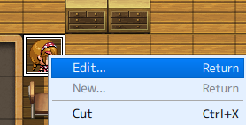
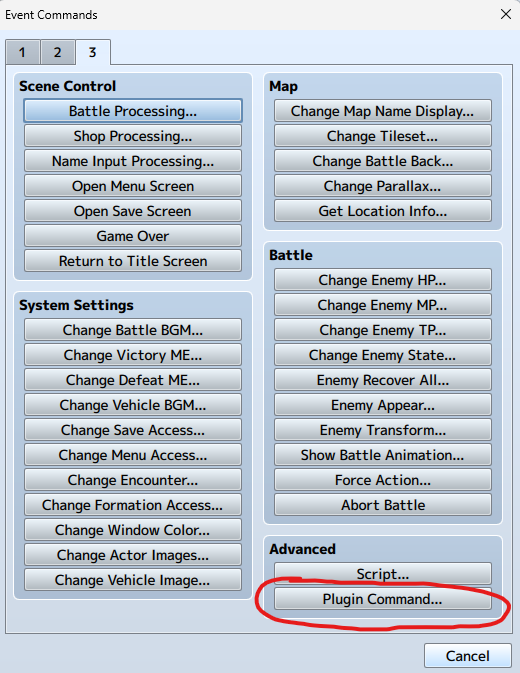
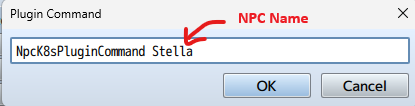

# Azure-isekai

Azure Isekai (異世界) is an open-source RPG designed for hands-on Azure learning through gamification. Ideal for junior to Higher Diploma students of Hong Kong Institute of Information Technology (HKIIT), it transforms Azure education into an engaging adventure.

1. Role-Playing Adventure: Students interact with NPCs who assign Azure tasks.
2. Task-Based Learning: Tasks involve setting up and managing Azure.
3. Scalable Grading: Application tests Azure setups within Azure Functions.
4. Progress Tracking: Students track progress and earn rewards.
5. This game offers practical Azure experience in a fun, cost-effective way.
6. GenAI Chat: Integrates Generative AI to make NPC interactions more dynamic and fun, enhancing the overall learning experience.

This repository hosts a Web RPG game that you can fork and customize to your liking.

## Demo

# Development

This game was created using [RPG maker](https://www.rpgmakerweb.com/), with a custom plugin, "NpcK8sPluginCommand.js," located in the "js\\plugins" directory.
You can modify the game within RPG Maker. To enable non-player characters (NPCs) to interact with the grader API, you must configure the Plugin Command.

## How to set the NPC NpcK8sPluginCommand?

1. **Open the NPC Editor:** Right-click the NPC and select "Edit" from the context menu.

   

2. **Access Plugin Commands:** Within the NPC Editor, click the "Plugin Command" button.

   

3. **Define the Plugin Command:** Enter the desired command in the provided field. Ensure the command includes the unique NPC name as defined in the `NpcBackgroundTable`.

   

## Game Development and Testing

1. Open the game folder in VS Code.
2. Install the [Live Server](https://marketplace.visualstudio.com/items?itemName=ritwickdey.LiveServer) extension.
3. Right-click `index.html` and select "Open with Live Server."
4. Set the query parameters:
   `?baseUrl=https://your-api-endpoint/&game=game01&apiKey=INDIVIDUAL_API_KEY`

## Core Developers

Students from [Higher Diploma in Cloud and Data Centre Administration](https://www.vtc.edu.hk/admission/en/programme/it114115-higher-diploma-in-cloud-and-data-centre-administration/)

- [錢弘毅](https://www.linkedin.com/in/hongyi-qian-a71b17290/)
- [Ho Chun Sun Don (何俊申)](https://www.linkedin.com/in/ho-chun-sun-don-%E4%BD%95%E4%BF%8A%E7%94%B3-660a94290/)
- [Kit Fong Loo](https://www.linkedin.com/in/kit-fong-loo-910482347/)
- [Yuehan WU](https://www.linkedin.com/in/yuehan-wu-a40612290/)
